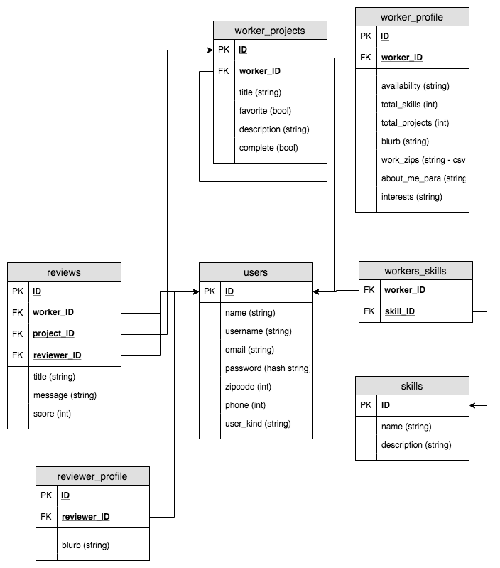

# DayWorker-server
The goal of DayWorker is to create a bridge between day laborers and those looking to hire a helping hand. DayWorker is designed to connect job seekers to a variety of different work, whether that be simple yard work, retiling a shower, or even building a deck; DayWorker will bring it's users together so that eager to work helping hands can find those that need them.

## Database Structure



## Setup
1. Fork and clone this repository
1. `createdb day-worker-dev`
1. `npm run setup`

## Routes

### UserRoutes ------------------------------------------------------------

**GET /api/users/:id**
- Get a user by ID

**GET /api/users/:id/projects**
- Get all projects for a specific user

**GET /api/users/:id/projects/:pid**
- Get a specific project for a specific user

**POST /api/users/:id/projects**
- Create a project for a specific user
    - require fields in req.body.create:
```
{
    postUser,       // INTEGER
    postTitle,      // STRING
    postZip,        // INTEGER
    postBlurb,      // STRING
    active,         // BOOLEAN
    toolsRequired,  // BOOLEAN
    willTeach,      // BOOLEAN
    contact         // STRING
}
```

**POST /api/users/register**
- Create a new user
    - required fields in req.body.create:
```
{
    name,           // STRING
    username,       // STRING
    email,          // STRING
    password,       // STRING
    zipcode,        // INTEGER
    phone           // STRING
}
```

**POST /api/users/login**
- Login existing user
    - required fields in req.body:
```
{
    email,          // STRING
    password,       // STRING
}
```

**PATCH /api/users/:id**
- Update current user info
    - at least one(1) of the following fields in body is required:
```
{
    name,           // STRING
    username,       // STRING
    email,          // STRING
    password,       // STRING
    zipcode,        // INTEGER
    phone           // STRING
}
```

**PATCH /api/users/:id/projects/:pid**
- Update an existing project for a current user
    - at least one(1) of the following fields in req.body is required:    
```
{
    postUser,       // INTEGER
    postTitle,      // STRING
    postZip,        // INTEGER
    postBlurb,      // STRING
    active,         // BOOLEAN
    toolsRequired,  // BOOLEAN
    willTeach,      // BOOLEAN
    contact         // STRING
}
```

**DELETE /api/users/:id**
- Delete a user by ID

**DELETE /api/users/:id/projects/:pid**
- Delete a project via it's ID aswell as the user's ID

### ProjectsRoutes ------------------------------------------------------------

**GET /api/projects/?......=......**
- Get all jobs via zip or city
    - Examples:
```
'/api/projects/?zip=98115'
'/api/projects/?city=seattle'
```

**GET /api/projects/:pid**
- Get a project via it's ID in database

**POST /api/projects/:pid/workers**
- Add worker to project's workers list

**DELETE /api/projects/:pid/workers/:wid**
- Remove worker from project's workers list


### SkillsRoutes ------------------------------------------------------------

**POST /api/skills**
- Add new skill to skills pool _-*-Admin only-*-_

**POST /api/users/:id/skills**
- Add a skill to a user's skill list

**DELETE /api/users/:id/skills/:sid**
- Remove a skill from a user's skill list


### ReviewsRoutes ------------------------------------------------------------

**GET /api/users/:id/reviews**
- Get all reviews for a specific user

**GET /api/users/:id/reviews/:rid**
- Get a specific review for a specific user

**POST /api/users/:id/reviews**
- Create a new review for a user
    - required fields in req.body.create:
```
{
    email,              // STRING
    password,           // STRING
    worker_user_ID,     // INTEGER
    project_ID,         // INTEGER
    reviewer_user_ID,   // INTEGER
    title,              // STRING   (max of 35 char)
    review_author,      // INTEGER
    review_about,       // INTEGER
    rate,               // INTEGER
    photo,              // STRING
    blurb,              // STRING   (max of 1000 char)
    service_type,       // INTEGER
}
```

**PATCH /api/users/:id/reviews/:rid**
- Update a specific review for a user
    - at least one(1) of the following fields in req.body.create is required:
```
{
    email,              // STRING
    password,           // STRING
    worker_user_ID,     // INTEGER
    project_ID,         // INTEGER
    reviewer_user_ID,   // INTEGER
    title,              // STRING   (max of 35 char)
    review_author,      // INTEGER
    review_about,       // INTEGER
    rate,               // INTEGER
    photo,              // STRING
    blurb,              // STRING   (max of 1000 char)
    service_type,       // INTEGER
}
```

**DELETE /api/users/:id/reviews/:rid**
- Delete a specific user's review